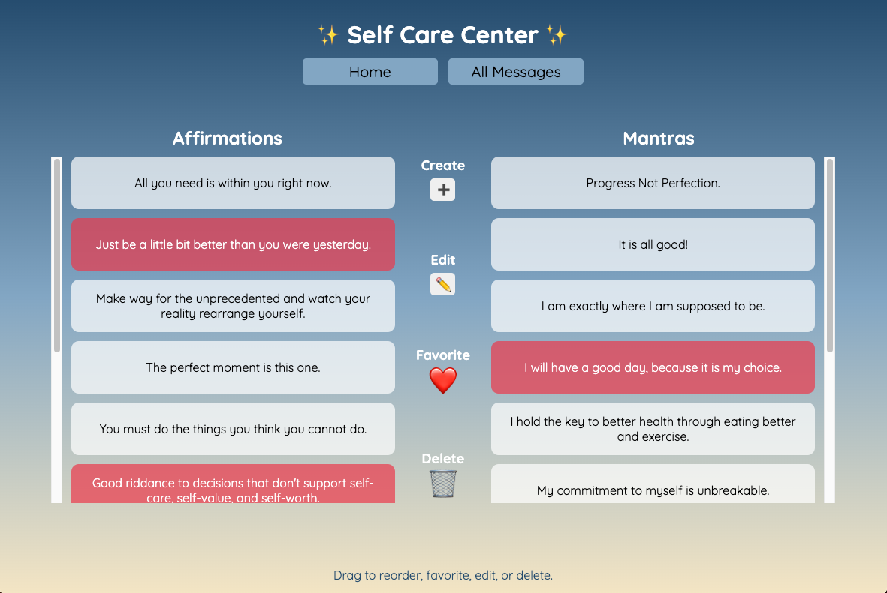

# Self-Care Center 

### Abstract:
[//]: <> (Briefly describe what you built and its features. What problem is the app solving? How does this application solve that problem?)
This application provides users with a random Affirmation or Mantra to aid in self care. The user can manage their messages in the "All Messages" page where they can sort, create, edit, favorite, and delete messages using a drag and drop interface.

### Installation Instructions:
[//]: <> (What steps does a person have to take to get your app cloned down and running?)
1. Copy the SSH key on GitHub inside the code dropdown
2. Using the terminal, run `git clone [SSH key here]`
3. Run command `cd self-care-center` to move into the project directory
4. Run command `open index.html` to launch the application in the web browser

### Preview of App:
[//]: <> (Provide ONE gif or screenshot of your application - choose the "coolest" piece of functionality to show off.)

### Context:
[//]: <> (Give some context for the project here. How long did you have to work on it? How far into the Turing program are you?)
This project was created from scratch during my third week as a student at Turing. Provided with a project spec, the task was to exactly replicate a screenshot with HTML and CSS. After the UI was built, JavaScript was used to add the bare minimum functionality detailed in the project spec. Students were then allowed to add their own feature, which is the "All Messages" page in my project.

### Contributors:
[//]: <> (Who worked on this application? Link to their GitHubs.)
- Jason Kirchman, github.com/kirch1

### Learning Goals:
[//]: <> (What were the learning goals of this project? What tech did you work with?)
- Become more comfortable using HTML and CSS to build an interface from scratch.
- Build a deeper understanding of the interaction between the DOM and the Data Model.
- Continue to build understaning of the Git and GitHub branching, pushing, and merging workflow.
- Tech: JavaScript, HTML, CSS, DOM manipulation, git, GitHub.

### Wins + Challenges:
[//]: <> (What are 2-3 wins you have from this project? What were some challenges you faced - and how did you get over them?)
- Win: Learning about and implementing drag and drop event listeners on the All Messages page.
- Win: Becoming more comfortable with flexbox.
- Win: Only updating the DOM based on changes to the Data Model.
- Challenge: It took a lot of trial and error to get flexbox behaving the way I wanted.
- Challenge: I needed to store the messages in a single object array for my "All Messages" page to work as intended. This made it more difficult to get a random message of a certain message type, as they were no longer in seperate arrays. I overcame this by creating a function to filter my Object array before getting a random element.
